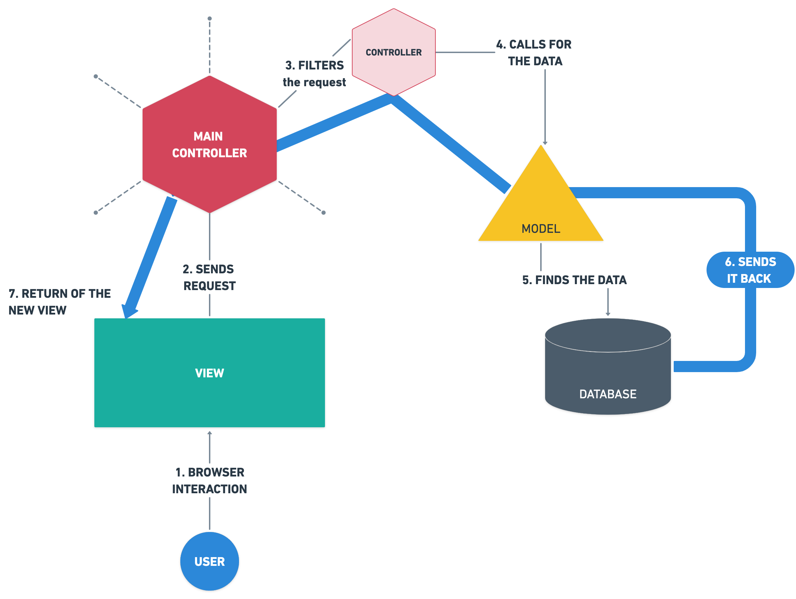

</img>

# mvc-pattern-basics
In this pill you will learn to implement one of the most common architecture 
patterns and you will practice an example following the MVC standards.

## Questions:

1. What is an architecture pattern?  

    First we need to understand software architecture:
    SA is how the how the defining components of a software system are organized
    and assembled (AP). How they communicate with each other (M).
    And the constraints the whole system is ruled by (QA).   
  
    The architecture its composed by:
    - (AP) Architectural patterns: Defines the granularity of the components,
        how small or big a component should be.
    - (M) Messaging mechanisms & API's:
    - (QA) Quality Attributes: scalability, adaptabilitty, performance, security
        ...

2. What is the MVC pattern?  
    MVC Pattern stands for Model-View-Controller Pattern. This pattern is used 
    to separate application's concerns.
    - Model: Only does interactions with the data. 
    - View: The view listens to the user events/interactions with the DOM and 
    sends the request to the controller. Then waits for that data to come back
    to render it.
    - Controller: It listens for the view REQUESTS and decides where to send 
    them. If its a data request calls the model to search for that data and 
    sends that information back to the view for the render.

3. Draw a scheme where you understand that the MVC pattern is clearly  
        
    

4. Explain in which cases you would use this pattern   
    In any app that needs constant data manipulation and dynamic rendering.

5. Describe step by step what happens in this pattern from when you create a   
   Request until a Response is returned (you can give more than one example if 
   you consider it necessary).   

    COVID TEST MANAGER APP:  
    1. The user/admin selects the patient record to see the results of the test.

    2. The VIEW listens to that request of the user and sends the event to --->

    3. The CONTROLLER that filters this request. If any data manipulation its 
    needed (it is the case because we need a covid test result )the CONTROLLER 
    calls the MODAL/s that will search for that data specifically.  

    4. The MODAL will ask to the server for the data and will convert it to for 
    example a JSON format to the CONTROLLER. 

    5. Finally the CONTROLLER gives the response to the VIEW that will do all 
    the render work to show the test to the user.
    
6. What advantages do you think this pattern has to use?    
    If you work on a dynamic web page or application that works with data MVC its
    a fantastic software design pattern. The pros of working with the rendering 
    and the data separated grows exponentially with the size of the application.
      
    The organization of the project will improve.
    If any errors are find you have two firewalls (the modal and the controller)
    before the render.
    Really good to work in parallel on the same project because of the 
    fragmentation. 
    Better debuging.
    Easy to update.

## TODO's:

- [ ] Implement the MVC pattern using PHP without any library
- [ ] You must have a clear directory structure to be able to implement the pattern
- [ ] You must have a minimum of:
    - (M) 2 models with 3 different functions that obtain information from a database 
        from at least 2 tables
    - (V) 3 views
        At least one of the views will have to be reused for more than one action.
    - (C) 2 controllers
        You must create a main controller ( index.php ) that is responsible for 
        receiving the request from the main page.
        You must create one file for each controller and one function for each action.
        Each action will receive the request as a parameter.

- [ ] There must be almost 4 different actions that demonstrate that the pattern 
is implemented correctly and are capable of displaying the data obtained from 
the source in a view.  URL’s must be controlled by parameters passed by GET method.

- [ ] Design SQL database.
